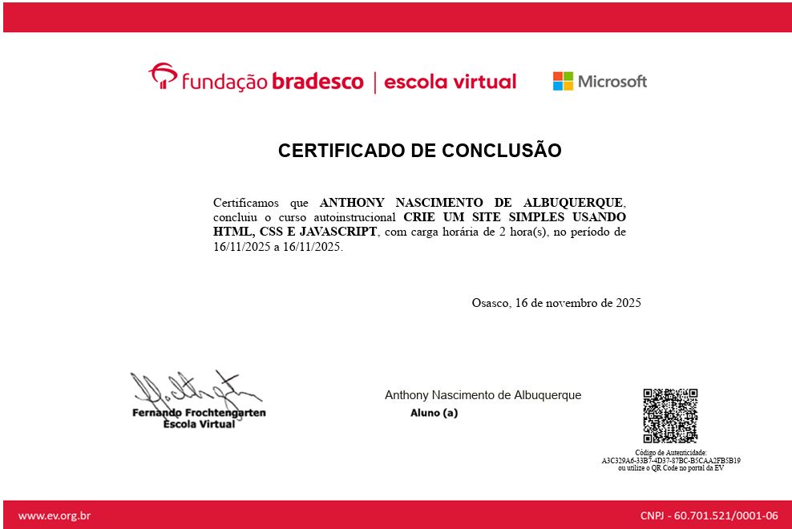

# site-simples-fundacao-bradesco

## 🧠 Curso de Desenvolvimento Web pela Fundação Bradesco

Este projeto foi desenvolvido como parte do curso **"Crie um Site Simples usando HTML, CSS e JavaScript"** oferecido pela **Fundação Bradesco | Escola Virtual**, em parceria com **Microsoft**. O objetivo é aplicar os fundamentos do desenvolvimento web para construir uma página funcional e interativa.

## 📚 Conteúdo do Projeto

O site inclui:

- **HTML**: estrutura semântica da página
- **CSS**: estilização visual e responsividade
- **JavaScript**: interatividade e manipulação de eventos

## 🚀 Funcionalidades

- Layout simples e responsivo
- Estilos personalizados com CSS
- Interações básicas com JavaScript (ex: botões, mensagens, validações)

## 🛠️ Tecnologias Utilizadas

- HTML5
- CSS3
- JavaScript (ES6)
- Visual Studio Code (com extensão **Open in Browser**)

## 🧾 Certificação

Curso concluído em **16 de novembro de 2025**, com carga horária de **2 horas**, certificado pela Fundação Bradesco | Escola Virtual.

---

📌 Para visualizar o projeto localmente, basta abrir o arquivo `index.html` com a extensão **Open in Browser** no VS Code.
